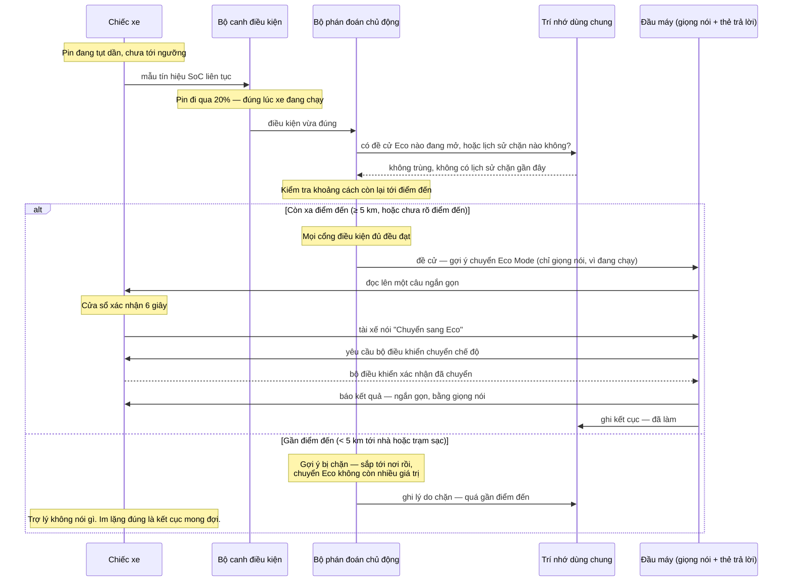

# Sequence — Khuyến nghị theo trạng thái pin

Kịch bản đường thuận của tính năng này: xe đang chạy, pin tụt qua ngưỡng cảnh báo mềm, trợ lý gợi
ý chuyển sang Eco Mode, tài xế đồng ý, xe xác nhận đã chuyển. Hình dưới đây theo đúng luồng chính
tả trong tài liệu yêu cầu nghiệp vụ — xem mục *"tra cứu"* trong wiki nếu cần đối chiếu tên miền
trạng thái xe hay tên sự kiện.

## Những chỗ dễ đọc sai

- **Đường thuận có một nhánh im lặng hợp lệ ngay trong nó.** Gần điểm đến không phải một lỗi hay
  một trường hợp biên — đó là một trong hai kết cục bình thường của cùng một tình huống kích hoạt,
  và cả hai đều đáng được kiểm chứng.
- **Kết quả không phải "đã nói" mà là "bộ điều khiển đã xác nhận".** Trợ lý không được báo thành
  công cho một việc chưa quan sát thấy thật sự xảy ra — nếu bộ điều khiển từ chối hoặc không phản
  hồi, kết cục là thất bại, không phải đã làm, dù tài xế đã nói đồng ý.
- **Không phản hồi trong 6 giây không phải một lỗi.** Đó là một kết cục có tên riêng (bị bỏ qua),
  khác với việc tài xế nói "không" (bị từ chối) — hai kết cục này kéo theo hai khoảng nghỉ khác
  nhau trước khi trợ lý được hỏi lại.
- **Việc kiểm tra trí nhớ dùng chung xảy ra trước khi kiểm tra khoảng cách**, không phải sau. Một
  đề cử Eco đang mở, hoặc một lần bị chặn gần đây, dừng luồng sớm hơn cả việc hỏi xe đang ở đâu.
